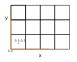

:Author: Marco Cammarata
:Date: 22/11/2022
:Keywords: description of conventions used by pyFAI

Conventions
===========

This page describes the conventions used by pyFAI.
Some useful information (orientation, position of observer, etc.) can be found in :ref:`geometry`

Mask
----

PyFAI considers masks with values equal to zero 0 as valid pixels (mnemonic: non zero pixels are *masked out*).
This is a different convention with respect to other programs used at ESRF like Lima that used no zero pixels as valid.

Pixel Coordinates
-----------------

The origin is set at the corner of a pixel as shown in the figure below for a simple 3×4 pixel matrix.

Note some specificities:

* Each pixel *n* starts at the coordinated *n* (included) and goes to the coordinate *n+1* (excluded). The center of any pixel is at half integer pixel coordinate. This convention differs by half a pixel from the one used in matplotlib where pixels range from *n-½* to *n-½*. Care must be taken when displaying images with matplotlib (when assessing beam-center for example): there is ½ pixel offset.
* The origin is at the bottom and differs from the *camera* convention where the origin is at the top. As a consequence, the sign of the ᵪ-angle gets  inverted.
* The detector is seen from the sample and differs from the *camera* convention where the observer is behind the camera. As a consequence, the sign of the ᵪ-angle gets  inverted.
* The former 2 inversions cancel each other.

Detector orientation
--------------------

Since 2023.12, it is possible to take into account the detector orientation in pyFAI.
There is a norme in photography for storing this kind of information in an EXIF tag as an integer with a value from 1 to 8::
    1        2       3       4         5            6           7          8
 o              o                 o                                              o
  888888  888888      88   88      8888888888  88                  88  8888888888
  88          88      88   88      88  88      88  88          88  88      88  88
  8888      8888    8888   8888    88          8888888888  8888888888          88
  88          88      88   88                 o                      o
  88          88  888888   888888
                        o o

In photography the observer is behind the camera, thus the image's first pixel of the image (origin, noted (o)) is by default on the top-left.
This differes in two point with pyFAI's definition:

 * pyFAI considers the frame seen from the sample, so in front of the camera, this change of point of view is equivalent to a flip-right-left of the image
 * pyFAI considers the origin is a the bottom (left) of the image, so this corresponds to a flip-up-down of the image
 * Those two image flip result in a default orientation identified as *BottomRight (3)* by default on all detectors.

The *orientation* is a property of the *detector*, it is **intentionnally unmuttable** to prevent errors.
For now, only the geometries 1 to 4 are supported, the rotated geometries can easily be accomodated using the *rot3* parameter during the calibration of the experimental setup

Converting the calibration from *Dioptas* to process data with *pyFAI*
......................................................................

Despite *Diotas* uses the *pyFAI* library to perform the geometry calculation, refinement and PONI-file management, it offers the ability to actualy flip/rotate the image
and not only the representation of the image on the screen.
As a consequence, the user has to remind the sequence of operations performed on the image and the position of the origin.
Moreover, the image is flipped up-down when loaded in *Dioptas*, making thinks even more complicated (origin: TopRight, orientation 2).
The support for the *orientation* of the image allows to treat with *pyFAI* a dataset calibrated with *Dioptas*.
For this, edit the PONI-file and find the line entitled *detector_config* and declare or modify the value for the orientation like this::

   Detector_config: {"orientation": 2}

This will allow to treat the data.
Since the images are flipped, the direction of the azimuthal angle cannot match and the **chi** will not only differ in numeriacal values but most importantly in direction.
This has to be taken into account when performing texture analysis.

Conventions from the detector manufacturer
..........................................

Different detector manufacturer follow different convention, in addition to which acquisition software allow to save the image with some transformation applied.
Here are some information collected for the manufacture:

 * Dectris: orientation 2: TopRight
 * ... to be completed.

For now, all detectors are intialized with the orientation (3), i.e. it does not change with the convention used in pyFAI since 2010.
