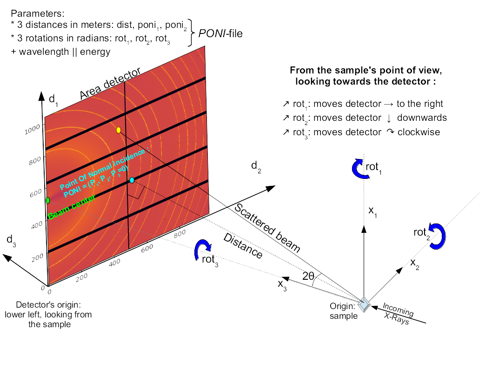

:Author: Jérôme Kieffer
:Date: 31/05/2016
:Keywords: generic description of the geometry
:Target: General audiance

PyFAI uses a 6-parameter geometry definition similar, while not rigorously
identical to SPD:
One distance, 2 coordinates to define the point of normal incidence and 3 rotations
around the main axis; these parameters are saved in text files usually
with the *.poni* extension.
In addition, the *poni-file* may contain the wavelength and the detector definition.

Image representation in Python
------------------------------

PyFAI takes diffraction images as 2D numpy arrays, those are usually read
using the FabIO library:

.. code-block:: python

   import fabio
   data = fabio.open("image.edf").data

But data can also be extracted from HDF5 files with h5py and displayed using matplotlib:

.. code-block:: python

   %pylab
   imshow(data, origin="lower")

Because Python is written in C language, data are stored lines by lines, this means to go
from a pixel to the on its right, one offets the position by the pixel width.
To go the pixel above the current one, on needs to offset by the length of the line.
This is why, if one considers the pixel at position (x,y), its value can be retrieved by data[y,x]
(note the order y,x, this is not a bug!).
We usually refer the *x* axis as the fast dimension (because pixels are adjacent) and the *y* axis
as the slow axis (as pixel are appart from each other by a line length).
More information on how `numpy array are stored can be found at here <https://github.com/numpy/numpy/blob/master/doc/source/reference/arrays.ndarray.rst>`_

Like most scientific packages, the origin of the image is considered
to be at the **lower-left corner** of the image to have the polar angle growing
from 0 along the x axis to 90 deg along the y axis.
This is why we pass the *origin="lower"* option to *imshow* (from the matplotlib library).
Axis 1 and 2 on the image (like in poni1 & poni2)
refer to the slow and fast dimension of the image, so usually to the y and x axis
(and not the opposite)

Position of the observer
------------------------

There are two (main) conventions when representing images:

* In imaging application, one can can replace the camera by the eye, the camera looks at the scene. In this convention, the origin is usually at the top of the image.
* In diffraction application, the observer is situated at the sample position and looks
  at the detector, hence on the other side of the detector.

Because we measure (signed) angles, the origin is ideally situated at the lower left of the image.
PyFAI being a diffraction application, it uses the later description.
Changing the point of view behind the detector changes the sign of the azimuthal angle.

Default geometry in pyFAI
-------------------------

In the (most common) case of *transmission diffraction setup* on synchrotrons (like ESRF, Soleil, Petra3, SLS...) this makes looks like:

* Observer looking at the detector from the sample position:
* Origin at the lower left of the detector
* Axis 1 (i.e. *y*) being vertical, pointing upwards
* Axis 2 (i.e. *x*) being horizontal, pointing to the center of the storage ring
* Axis 3 (i.e. *z*) being horizontal, along the transmitted beam

Axis 3 is built in such a way to be orthogonal and (1,2,3) is a direct orientation.
This makes the sample position negative (at z<0).

Detector position
-----------------

In pyFAI, the experiment geometry is defined by the position of the detector in
space, the origin being located at the sample position, more precisely where the
X-ray beam crosses the diffractometer main axis.

With the detector being a rigid body, its position in space is described by
six parameters: 3 translations and 3 rotations.
In pyFAI, the beam center is not directly used as it is ill-defined with
highly tilted detectors.
Like SPD, we use the orthogonal projection of origin on
the detector surface called PONI (for Point Of Normal Incidence).
For non planar detectors, the PONI is defined in the plan z=0 in detector's
coordinate system.

Poni1 and Poni2 are distances in meter (along the *y* and *x* axis of the detector),
like the sample-detector distance, letting the calibration parameters be
independent of the pixel size hence stable regarding the binning factor of the detector.

In the same idea rot1, rot2 and rot3 are rotation along axis 1, 2 and 3, always expressed in radians.
Rotations applied in the same order: *rot1* then *rot2* and finally *rot3*.
Due to the axial symmetry of the Debye-Scherrer cones, *rot3* cannot be optimized but can be adjusted manually in some cases like if
the detector is not mounted horizontally and/or one cares about polarization correction.

When all rotations are zero, the detector is in transmission mode with the
incident beam orthogonal to the detector's surface.

