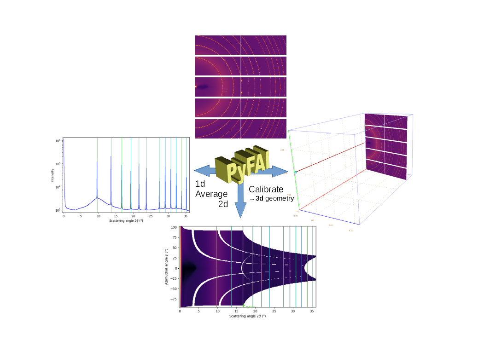

.. pyFAI documentation master file, created by
   sphinx-quickstart on Mon Nov 19 13:19:53 2012.

:Author: Jérôme Kieffer
:Date: 19/01/2021
:Keywords: generic description of the geometry
:Target: General audience

Fast Azimuthal Integration using Python
=======================================

PyFAI is a python libary for azimuthal integration of X-ray/neutron/electron scattering data acquired with area detectors.
For this, images needs to be re-binned in polar coordinate systems.
Additional tools are provided to calibrate the experimental setup, i.e. define where the detector is positioned in space considering the sample and the incident beam.

The core idea is to redistribute the signal acquired with the experimental geometry
into a geometry suitable for further analysis, like Rietveld refinement for power data
or Inverse Fourier Transform for SAXS data.
Unlike interpolation, this redistribution conserves the signal, its variance and
can be used for other types of transformation like distortion correction.

Since the alignment of the beam, the sample and the detector can never be perfect,
pyFAI tries to cope with it by calibrating their relative position using a
reference sample material (called calibrant).
After calibration, the geometry can be saved in a *poni-file* and used to perform azimuthal averaging
of several samples.
The geometry used is described in this scheme:

.. figure:: img/PONI.png
   :align: center
   :alt: The geometry used in pyFAI defined by 3 distances (in meter):
         the sample detector distance (normal, not along the beam),
         the coordinates of the orthogonal projection of the sample on the detector (called PONI)
         and 3 rotations (in radians) around the vertical, horzontal and incident beam (also horzontal)

This documentation starts with a general descriptions of the pyFAI library.
This first chapter contains an introduction, what it is, what it aims at
and how it works (from the scientists' point of view).
Especially, geometry, calibration, azimuthal integration algorithms are described.
Pixel splitting schemes are also explained there.

The second part is about how to use pyFAI, it starts with the typical usage on the command line
in the *cookbooks* section and advanced usage from the Python interface is explained in the *tutorials* section
wich describes some parts of the internal mechanics.
Finally, the manual pages of applications and the description of the programming interface (API) are appended.
Despite the installation section could be as simple a:
``pip install pyFAI``, full instructions for the installation are also provided, addressing platorm specific issues.

.. toctree::
   :maxdepth: 1

   pyFAI
   usage/index
   conventions
   man/scripts
   design/index
   api/modules
   operations/index
   ecosystem
   project
   changelog
   publications
   biblio
   glossary

Indices and tables
==================

* :ref:`genindex`
* :ref:`modindex`
* :ref:`search`
