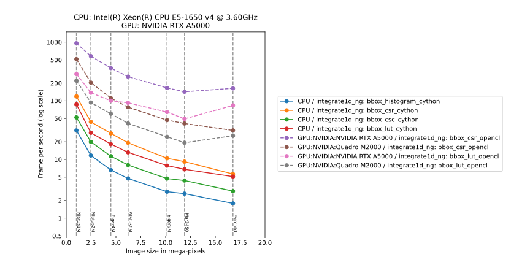

:Author: Jérôme Kieffer
:Date: 22/01/2021
:Keywords: Performance analysis
:Target: user

.. _pyfaibenchmark:

pyFAI-benchmark
===============

Measure the speed for azimuthal integration.

Purpose
-------

Measures the avarage execution time for azimuthal integration with various image sizes and algorithms,
can be used to select the most suitable integrator, to evaluate the perfomance of a given computer, debug
some hardware problems.

Image are between 1 and 16 Mpixel in size and all the method tested are providing the same
results for azimuthal integration (and validated).
The `bbox` pixel splitting schem is used which is also the default one.
By default, only the `histogram` and `CSR` algorithm (implemented in cython) are measued, but
OpenCL devices can be probed with options "-c", "-g" and "-a".

The result is a graphic with the number of images integrated per second as function
of the image size.
All the corresponding timings are also recorded in a JSON file.

Since pyFAI version 0.20, whith the new generation of integrator put in production,
both ``integrate1d_legacy`` and ``integrate1d_ng`` are benchmarked together to validate
the absence of performance regression.
A factor larger than 2 sould be considered as a bug.

Usage
-----

**-h**, **--help**
   show this help message and exit

**-v**, **--version**
   show program's version number and exit

**-d**, **--debug**
   switch to verbose/debug mode

**--no-proc**
   do not benchmark using the central processor

**-c**, **--cpu**
   perform benchmark using OpenCL on the CPU

**-g**, **--gpu**
   perform benchmark using OpenCL on the GPU

**-a**, **--acc**
   perform benchmark using OpenCL on the Accelerator (like XeonPhi/MIC)

**-s** SIZE, **--size** SIZE
   Limit the size of the dataset to X Mpixel images (for computer with
   limited memory)

**-n** NUMBER, **--number** NUMBER
   Perform the test for this amount of time, by default 10s/measurment

**-2d**, **--2dimention**
   Benchmark also algorithm for 2D-regrouping

**--no-1dimention**
   Do not benchmark algorithms for 1D-regrouping

**-m**, **--memprof**
   Perfrom memory profiling (Linux only)

**-r** REPEAT, **--repeat** REPEAT
   Repeat each measurement x times to take the best

**-ps** PIXELSPLIT [PIXELSPLIT ...], **--pixelsplit** PIXELSPLIT [PIXELSPLIT ...]
   Benchmark using specific pixel splitting protocols: no, bbox, pseudo,
   full, all

**-algo** ALGORITHM [ALGORITHM ...], **--algorithm** ALGORITHM [ALGORITHM ...]
   Benchmark using specific algorithms: histogram, CSR, CSC, all

**-i** IMPLEMENTATION [IMPLEMENTATION ...], **--implementation** IMPLEMENTATION [IMPLEMENTATION ...]
   Benchmark using specific algorithm implementations: python, cython,
   opencl, all

**-f** FUNCTION, **--function** FUNCTION
   Benchmark legacy (legacy), engine function (ng), or both (all)

**--all**
   Benchmark using all available methods and devices

Results
-------

This tool produces a graphic that looks like:

