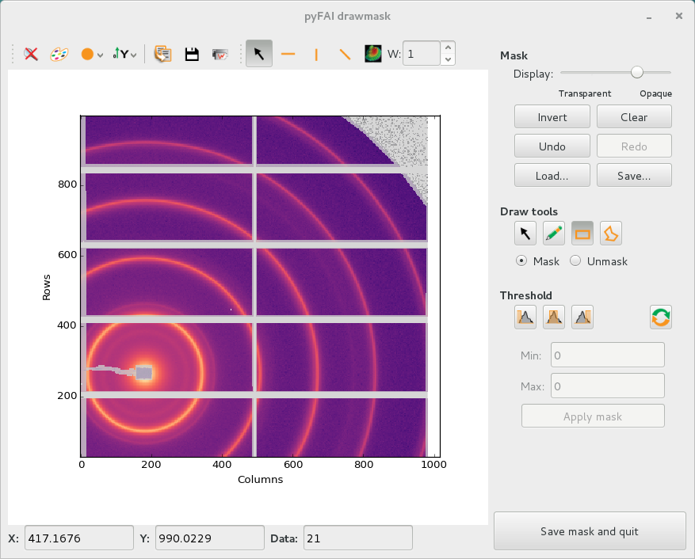

Mask generation tool: pyFAI-drawmask
====================================

Purpose
-------

Draw a mask, i.e. an image containing the list of pixels which are considered invalid
(no scintillator, module gap, beam stop shadow, ...).

This will open a window and let you draw on the first image (provided) with different tools
(brush, rectangle selection, ...).
When you are finished, click on the "Save mask and quit" button on the bottom right
of the window.
The mask image is saved into filename-mask.edf.
Optionally the script will print the number of pixel
masked and the intensity masked (as well on other files provided in input).

This user interface requires *silx* to be installed.

Usage: pyFAI-drawmask [options] file1.edf file2.edf ...

Options:
--------

  -h, --help     show this help message and exit
  -v, --version  show program's version number and exit

The mask image is saved into file1-masked.edf. Optionally the script will
print the number of pixel masked and the intensity masked (as well on other
files provided in input)
