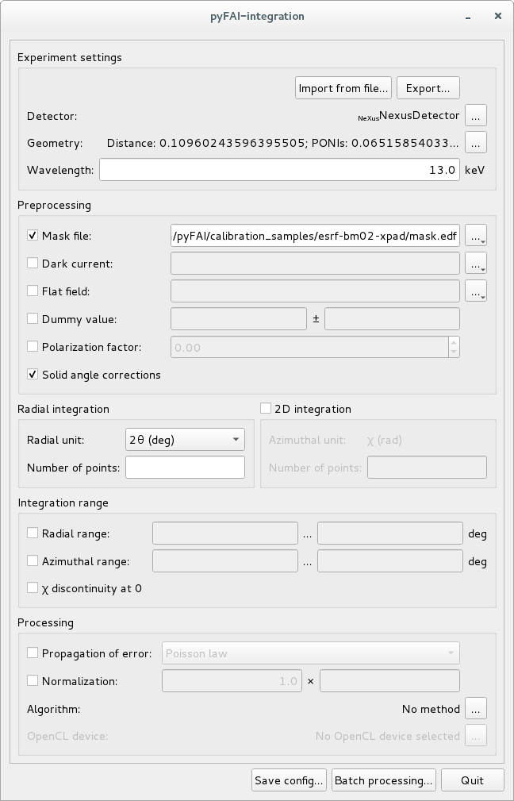

Integration tool: pyFAI-integrate
=================================

Purpose
-------

PyFAI-integrate is a graphical interface (based on Python/Qt5) to perform azimuthal integration
on a set of files. It exposes most of the important options available within pyFAI and allows you
to select a GPU (or an openCL platform) to perform the calculation on.

Usage
-----

``pyFAI-integrate [options] file1.edf file2.edf ...``

Options:
--------

	positional arguments:
	  FILE                  Files to be integrated

	optional arguments:
	  -h, --help            show this help message and exit
	  -V, --version         show program's version number and exit
	  -v, --verbose         switch to verbose/debug mode
	  --debug               Set logging system in debug mode
	  -o OUTPUT, --output OUTPUT
	                        Directory or file where to store the output data
	  -f FORMAT, --format FORMAT
	                        output data format (can be HDF5)
	  -s SLOW, --slow-motor SLOW
	                        Dimension of the scan on the slow direction (makes
	                        sense only with HDF5)
	  -r RAPID, --fast-motor RAPID
	                        Dimension of the scan on the fast direction (makes
	                        sense only with HDF5)
	  --no-gui              Process the dataset without showing the user
	                        interface.
	  -j JSON, --json JSON  Configuration file containing the processing to be
	                        done
	  --monitor-name MONITOR_KEY
	                        Name of the monitor in the header of each input files.
	                        If defined the contribution of each input file is
	                        divided by the monitor. If the header does not contain
	                        or contains a wrong value, the contribution of the
	                        input file is ignored. On EDF files, values from
	                        'counter_pos' can be accessed by using the expected
	                        mnemonic. For example 'counter/bmon'.
	  --delete              Delete the destination file if already exists
	  --append              Append the processing to the destination file using an
	                        available group (HDF5 output)
	  --overwrite           Overwrite the entry of the destination file if it
	                        already exists (HDF5 output)

Tips & Tricks:
--------------

PyFAI-integrate saves all parameters in a .azimint.json (hidden) file. This JSON file
is an ascii file which can be edited and used to configure online data analysis using
the LImA plugin of pyFAI.
