:Author: Jérôme Kieffer
:Date: 18/10/2018
:Keywords: Tutorials
:Target: Scientists

.. _cookbook_calibration_gui:

Calibration of a diffraction setup using the Graphical User Interface (GUI)
===========================================================================

Here is the *cookbook* which will explain you how to calibrate the setup of a
diffraction experiment within five minutes.
No advanced feature are presented.

The graphical tool for geometry calibration is called ``pyFAI-calib2``,
just open a terminal and type its name plus return to startup the application
which looks like this:

.. code-block:: shell

   $ pyFAI-calib2

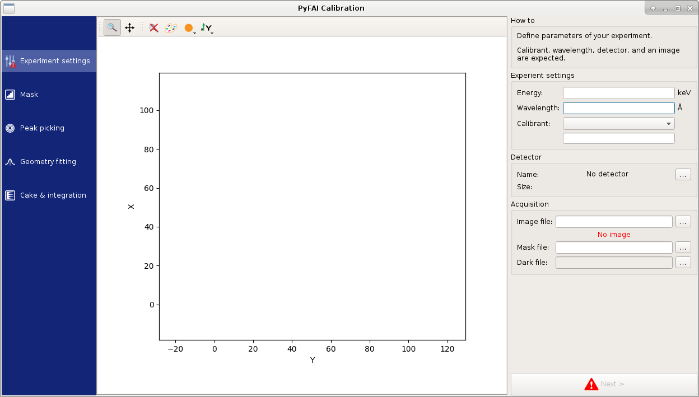

The windows is divided in 3 vertical tiles (panels) containing:

* On the left side, a list of tasks to be performed: setting-up, masking,
  peak-picking, ring-fitting and caking.
* A large central panel to display the image. Note the zoom, pan and colormap
  buttons on the top of the central panel.
* The right side panel contains a set of tools dedicated to each task and
  finishes with the ``Next`` button to switch to the next task.

We will now describe shortly every task by following a simple example.

Experiment settings
-------------------

This task contains all entries relative to the experiment setup.
It is the place where you can enter the energy of the beam (or the wavelength),
the calibrant and the detector used.

You have to provide the calibration image which is then displayed in the cental panel.
For example the file used in this cookbook can be downloaded from this link:
`Eiger4M_Al2O3_13.45keV.edf <http://www.silx.org/pub/pyFAI/cookbook/calibration/Eiger4M_Al2O3_13.45keV.edf>`_.
Click on the ``...`` on the right of ``Image file`` to open the file-browser
which will allow you selecting the file you just downloaded.

Finally, select the type of detector, here the image has been acquired using an Eiger4M manufactured by Dectris.
Once the detector is selected, its shape is overlaid to the image allowing a
direct validation of the detector size.
Mask and dark-current files can be provided in a similar way.

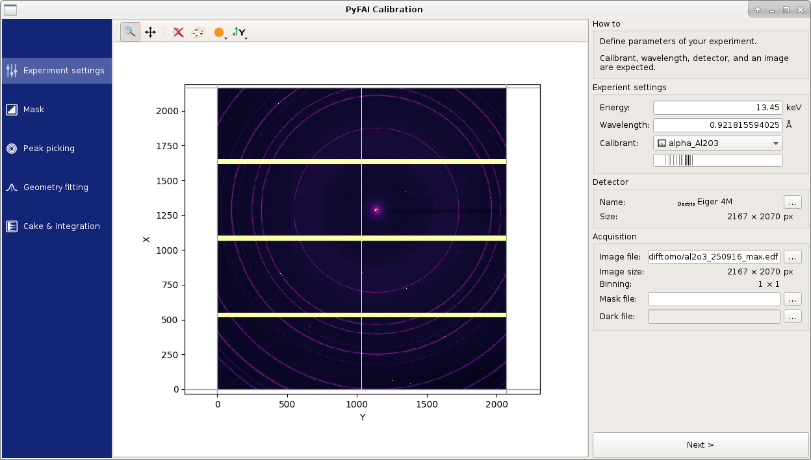
   
Finally set the ``energy`` of the experiment (or the ``wavelength``) and select the
reference compound used in the ``calibrant`` drop-down menu.
For this image, the beam was at 13.45 keV and the calibrant was corundum, which
is referenced ``alpha_Al2O3`` as in the figure.

You are now ready to define the mask, click on the ``Next>`` button.

Defining the mask
-----------------

The mask defines the list of pixels which are considered invalid.
It is displayed in green by default.
There are 3 drawing tools:

* rectangular selection
* polygonal selection (click on the first point to finish edition)
* Pencil selection

In addition, the mask can often be setup easily using one or two thresholds, or
by discarding infinite values or `NaN`.
Finally, masks can be inverted, saved and restored.

In our test-image, the Eiger detector has flagged overflow pixel with a very high value.
Discarding pixel above 65000 removes automatically all invalid pixels.
To remove pixels with some shadow, like the beam stop, the easiest is to use the
polygon tool (click on the square of the first point to finish the edition)
as in the figure bellow:

.. figure:: 2_mask.png
   :align: center
   :alt: Draw a mask on the image
   
Once you are done, click on the ``Next>`` button to pick some rings.

Peak-picking and ring assignment
--------------------------------

The geometry calibration is performed in pyFAI by a least-square fitting of peak
positions on ring number.

This task consists in selecting groups of peaks by left-clicking on them in the
image, and to assign the proper ring number to each group.

You will need to pick at least two rings.
Selecting the inner-most (2 or 3) rings is advised as they are the most intense
and miss assignment is unlikely.

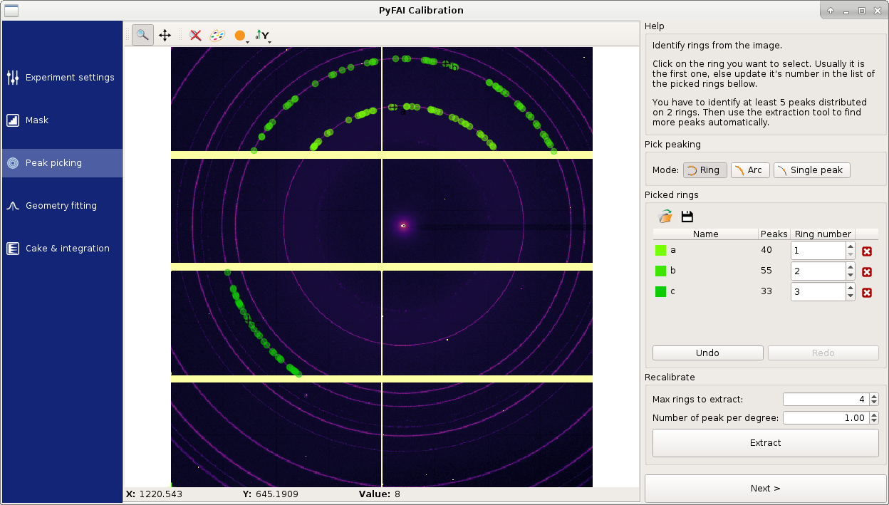

Double check the ring-number assignment in the right panel.
In the case of a difficult image (discontinuous rings, spotty signal, ...),
changing the picking mode can help.

*Nota:* this GUI tool uses 1-based numbers, unlike the command line tool which starts at 0.

We will skip the ``Recalibrate`` tool for now and go directly to the
geometry fitting by clicking on the ``Next>`` button.

Geometry fitting
----------------

When arriving on this task, the geometry is immediately fitted and you can see
the values of the 3 translation and 3 rotation.

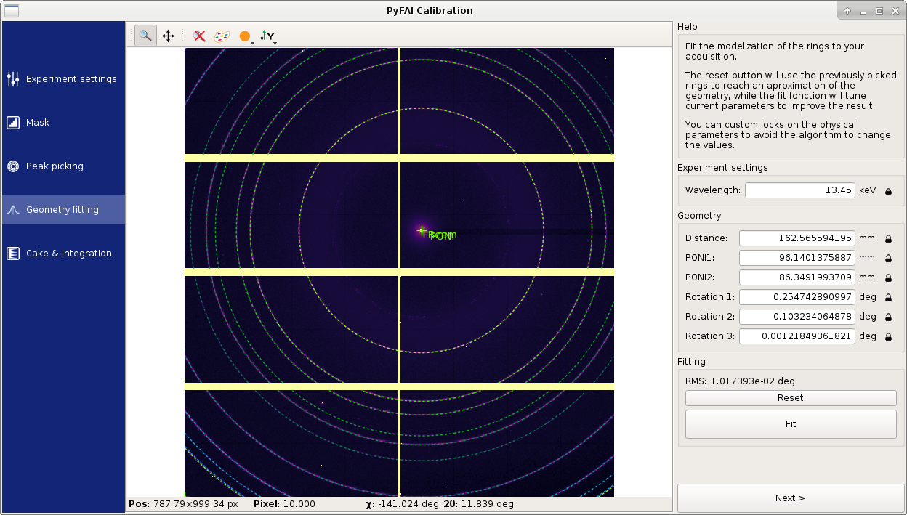

Values can be modified and fixed by clicking on the lock.
Click on the ``Fit`` button to re-fit the geometry.

Results may be displayed in various units by right-clicking on the unit.

3D rendering
------------

As soon as a geometry is computed, it can be displayed as a 3D rendering.
This view is available from the fitting screen, as a dedicated dialog.

It uses the internal modelization of pyFAI: each pixels of the redector is
spacialized. It textures them using the mask and the calibration image.

The beam is displayed a red cylinder smaller than the detector pixel size.
It hit a symbol of the sample on one side, and according to the geometry can hit
the detector on the other side.

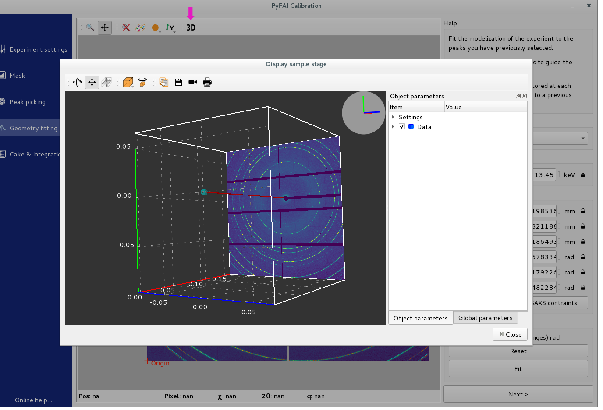

Automatic peak-extraction
-------------------------

Depending on the result, one may want to come back on the ``Peak picking`` task to
re-assign the ring number or select different peaks.

Or if it looks good, extracting many rings will allow for a more reliable fit.
For this, set the ``number of rings`` in the ``Recalibrate`` part and click ``Extract``,
like in this figure:

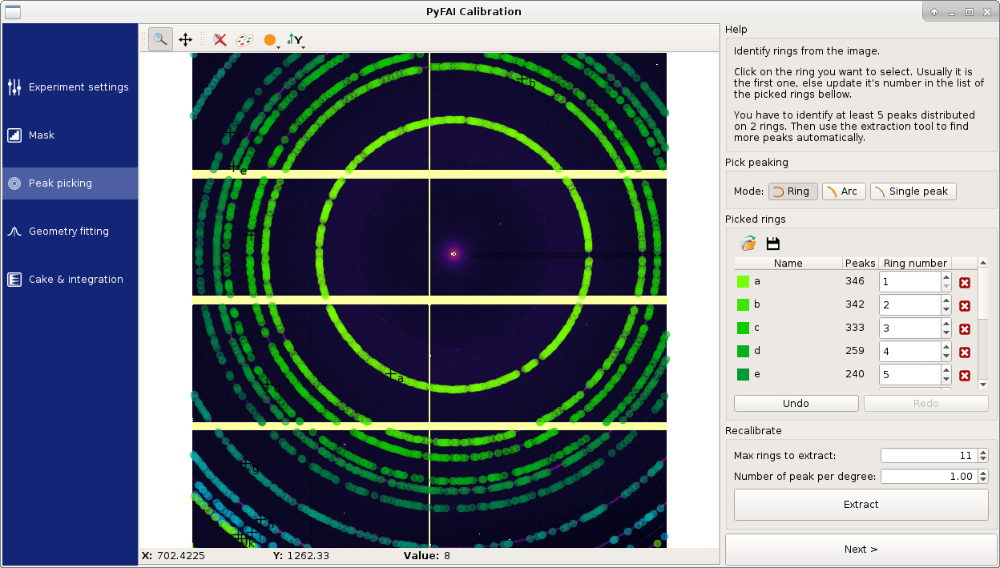

The selected peaks with their ring assignment can be exported at this stage,
by clicking on the ``floppy disk`` icon.
This is used in the case of a goniometer calibration.

Cake and Integration
--------------------

The last task displays the 1D and 2D integrated image with the ring position
overlaid to validate the quality of the calibration.

The radial unit can be customized and the images/curves can be saved.

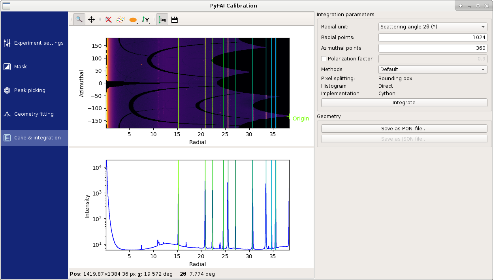

Last but not least, do not forget to save the geometry as a PONI-file for
subsequent integrations.

Feedback from integrated result to improve the mask
---------------------------------------------------

The 1D integration result can be used to notice misplaced peaks coming from hot
pixels.

.. figure:: improve_mask_1.png
   :align: center
   :alt: Azimuthal integration 

Once this hot pixel is located on the 1D spectrum, use the 2D view to localize
it, then mark it using the right mouse button.

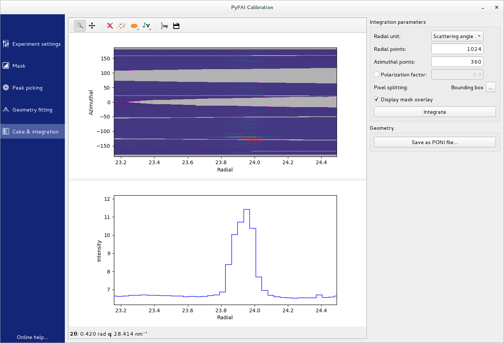

Back to the mask task.

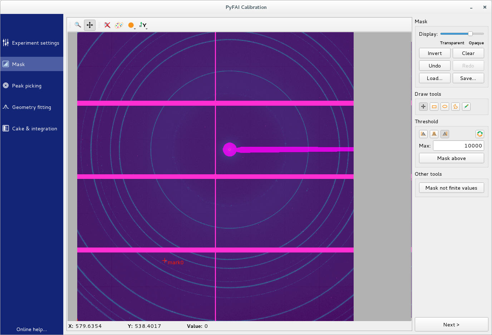

Zoom onto the mark.

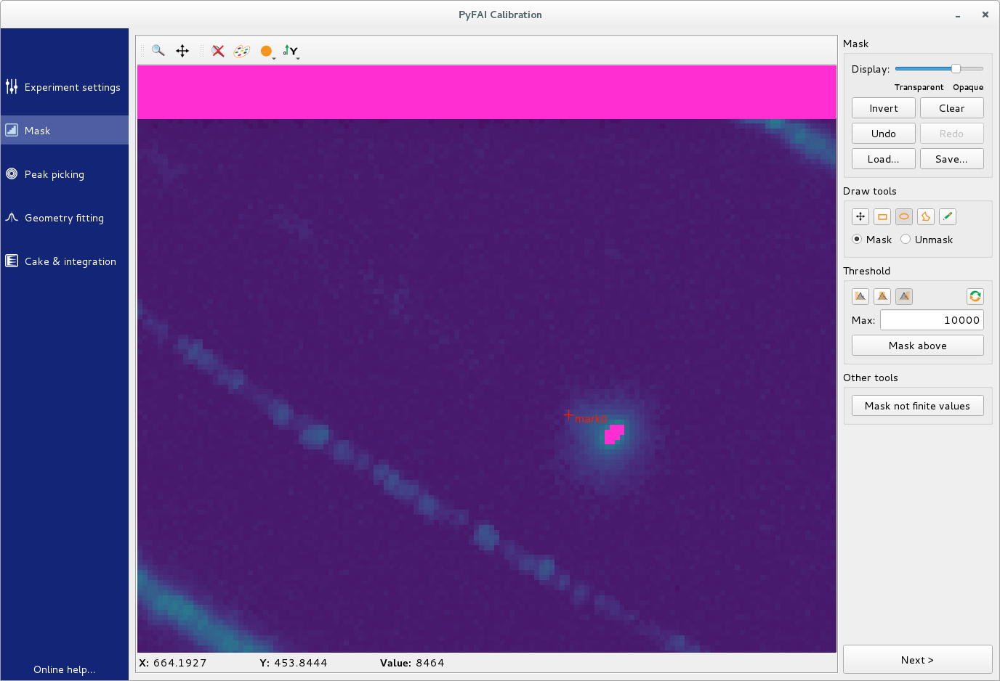

You can mask the defective area using one of the mask tools.

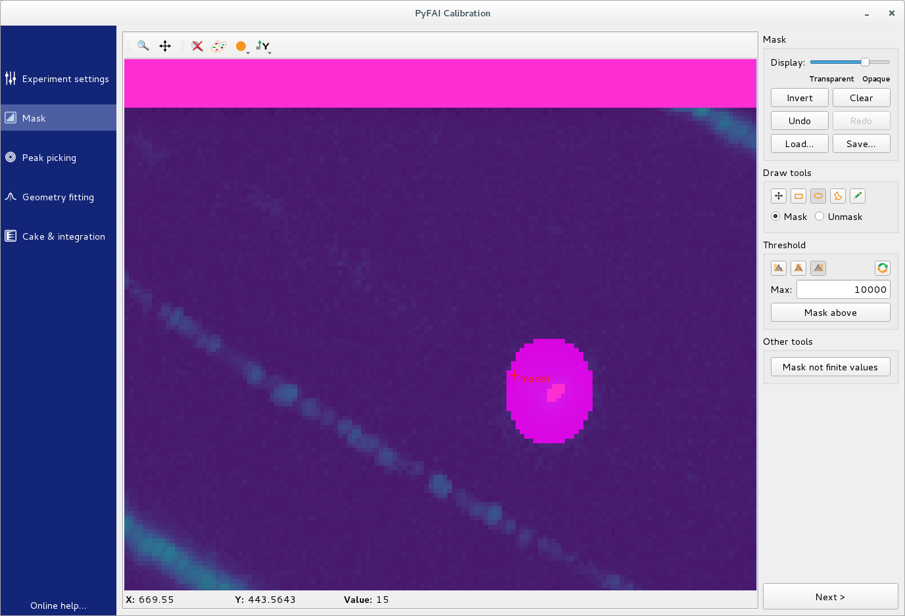

Back to the integration task, the result will be updated.

Conclusion
----------

This tutorial explained the 5 steps needed to perform the calibration of the
detector position prior to any diffraction experiment on a synchrotron.
