CCD calibration
===============

This tutorial presents how to calibrate the distortion from a CCD camera
coupled with a taper of optic fibers. If your camera is already
calibrated using Fit2D and you have access to the corresponding *spline*
file, this tutorial is not for you: simply create your detector object
like this **pyFAI.detectors.Detector(splineFile="example.spline")** and
you are done. This tutorial uses the image of a regular grid on the
detector.

It uses a procedure described in: "Calibration and correction of spatial
distortions in 2D detector systems" from Hammersley, A. P.; Svensson, S.
O.; Thompson, A. published in Nuclear Instruments and Methods in Physics
Research Section A, Volume 346, Issue 1-2, p. 312-321.
DOI:10.1016/0168-9002(94)90720-X

The procedure is performed in 4 steps: 1. peak picking 2. grid
assignment 3. distortion fitting 4. interpolation of the fitted data 5.
saving into a detector definition file

The picture used is the one of a regular metallic grid of holes (spaced
by 5mm), just in front of the detector. We will assume holes are
circular what looks correct in first approximation. Paralax error will
be ignored in a first time.

Peak picking
------------

Lets start with peak picking, for this, we will use the *FabIO* library
able to read the image and *matplotlib* to display the image. The
disortion is assumed to be minimal in the middle of the detector, so we
first focus on one spot in the middle:

.. code:: python

    #For final rendering switch from nbagg -> inline
    #%pylab nbagg
    %pylab inline
    #
    # search for the image containing the grid

.. parsed-literal::

    Populating the interactive namespace from numpy and matplotlib

.. code:: python

    ls

.. parsed-literal::

    CCD_calibration.ipynb  output_14_1.png  output_39_1.png  output_5_1.png
    CCD_calibration.rst    output_18_1.png  output_4_1.png   output_54_1.png
    frelonID22_grid.edf    output_21_1.png  output_45_1.png  output_6_1.png
    output_12_1.png        output_24_1.png  output_48_1.png  output_8_1.png
    output_13_1.png        output_29_1.png  output_50_1.png

.. code:: python

    fname = "frelonID22_grid.edf"
    #fname = "corrected.edf"
    import fabio
    img = fabio.open(fname).data

.. code:: python

    imshow(img, interpolation="nearest", origin="lower")

.. parsed-literal::

    <matplotlib.image.AxesImage at 0x7fe7003270f0>

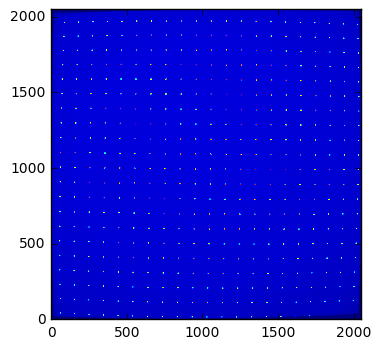

.. code:: python

    #Zoom into a spot in the middle of the image, where the distortion is expected to be minimal
    imshow(img[1060:1100,1040:1080], interpolation="nearest", origin="lower")

.. parsed-literal::

    <matplotlib.image.AxesImage at 0x7fe7002c7dd8>

.. image:: output_5_1.png

.. code:: python

    #Look at the profile of the peak to measure the width (it is expected to be a crenel)
    plot(img[1060+25,1040:1060])

.. parsed-literal::

    [<matplotlib.lines.Line2D at 0x7fe70023b048>]

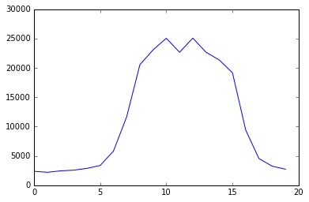

Let's look at one spot, in the center of the image: it is circular and
is slightly larger than 10 pixels. We will define a convolution kernel
of size 11x11 of circular shape with sharp borders as this is what a
perfect spot is expected to look like. The kernel is normalized in such
a way it does not modify the average intensity of the image

Now convolve the image with this circular kernel using scipy.signal (in
direct space: the kernel is small and performance does not really matter
here).

It is important to have an odd size for the kernel for convolution as an
even shape would induce an offset of 1/2 pixel in the located
peak-position.

.. code:: python

    size = 11 #Odd of course
    center = (size-1)//2
    y, x = numpy.ogrid[-center:center+1,-center:center+1]
    r2 = x*x + y*y
    kernel = (r2<=(center+0.5)**2).astype(float)
    kernel /= kernel.sum()
    imshow(kernel, interpolation="nearest", origin="lower")

.. parsed-literal::

    <matplotlib.image.AxesImage at 0x7fe6f72859b0>

.. image:: output_8_1.png

.. code:: python

    from scipy import ndimage, signal

.. code:: python

    cnv = signal.convolve2d(img, kernel, mode="same")

.. code:: python

    #Check that size is unchanged.
    print(img.shape) 
    print(cnv.shape) 

.. parsed-literal::

    (2048, 2048)
    (2048, 2048)

.. code:: python

    #Check the image still looks the same. it is just supposed to be smoother.
    imshow(cnv, origin="lower", interpolation="nearest")

.. parsed-literal::

    <matplotlib.image.AxesImage at 0x7fe6c9565c88>

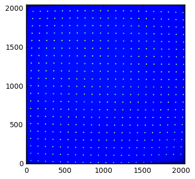

.. code:: python

    #Zoom into the very same spot to ensure it is smoother
    imshow(cnv[1060:1100,1040:1080], interpolation="nearest", origin="lower")

.. parsed-literal::

    <matplotlib.image.AxesImage at 0x7fe6c94c94e0>

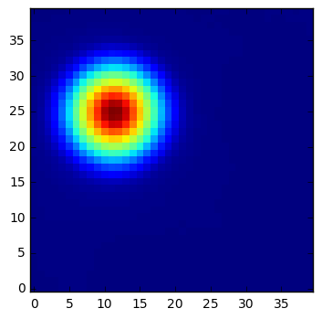

.. code:: python

    # and here again the same profile:
    plot(cnv[1060+25,1030:1070])
    # the peak got broader (2x) but much smoother on the top: this is what we are interrested in.

.. parsed-literal::

    [<matplotlib.lines.Line2D at 0x7fe6c94b0978>]

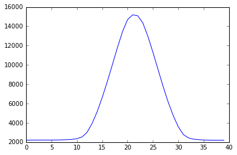

After convolution with a pattern of the same shape as the hole, the peak
center is located with a sub-pixel resolution. The peak has a full size
of 30 pix in 1 dimension.

All peak positions will be extracted using the pyFAI inverse watershed
algorithm. Once all regions are segmented, the ones too small are sieved
out and the remaining ones are classifies according to their peak
intensity using an histogram. As intensity vary a lot, this histogram it
is done on the log-scale of the intensity.

.. code:: python

    mini = (kernel>0).sum()
    print("Number of points in the kernel: %s"%mini)

.. parsed-literal::

    Number of points in the kernel: 97

.. code:: python

    try: #depends if the version of pyFAI you are using
        from pyFAI.watershed import InverseWatershed
    except:
        from pyFAI.ext.watershed import InverseWatershed
        #Version of pyFAI newer than feb 2016
    iw = InverseWatershed(cnv)
    iw.init()
    iw.merge_singleton()
    all_regions = set(iw.regions.values())
    regions = [i for i in all_regions if i.size>mini]
    
    print("Number of region segmented: %s"%len(all_regions))
    print("Number of large enough regions : %s"%len(regions))

.. parsed-literal::

    WARNING:pyFAI.utils:Exception No module named 'fftw3': FFTw3 not available. Falling back on Scipy
    WARNING:pyFAI.timeit:init_labels took 1.799s
    WARNING:pyFAI.timeit:init_borders took 0.064s
    WARNING:pyFAI.timeit:init_regions took 0.599s
    WARNING:pyFAI.timeit:init_pass took 0.186s
    WARNING:pyFAI.timeit:merge_singleton took 0.044s

.. parsed-literal::

    Number of region segmented: 79513
    Number of large enough regions : 8443

.. code:: python

    s = [i.maxi for i in regions]
    hist(numpy.log10(s), 20)
    #Look for the maximum value in each region to be able to segment accordingly

.. parsed-literal::

    (array([  1.00000000e+00,   0.00000000e+00,   0.00000000e+00,
              0.00000000e+00,   0.00000000e+00,   0.00000000e+00,
              0.00000000e+00,   0.00000000e+00,   0.00000000e+00,
              1.00000000e+00,   2.85000000e+02,   5.99900000e+03,
              1.71900000e+03,   1.00000000e+00,   0.00000000e+00,
              1.00000000e+00,   3.00000000e+00,   2.30000000e+01,
              1.17000000e+02,   2.93000000e+02]),
     array([ 2.05537045,  2.1621182 ,  2.26886594,  2.37561369,  2.48236143,
             2.58910918,  2.69585692,  2.80260467,  2.90935241,  3.01610016,
             3.1228479 ,  3.22959565,  3.33634339,  3.44309114,  3.54983888,
             3.65658663,  3.76333437,  3.87008212,  3.97682986,  4.08357761,
             4.19032535]),
     <a list of 20 Patch objects>)

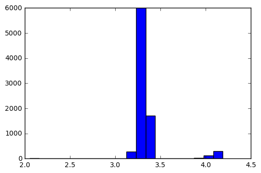

There are clearly 3 groups of very different intensity, well segragated:

-  around 10^2.1 (~125), those are the peaks where no tapper brings
   light
-  around 10^3.4 (~2500), those are segmented region in the background
-  above 10^3.9 (~8000), those are actual peaks, we are looking for.

We retain all peaks >10^3.5

.. code:: python

    peaks = [(i.index//img.shape[-1], i.index%img.shape[-1]) for i in regions if (i.maxi)>10**3.5]
    print("Number of remaining peaks: %s"%len(peaks))

.. parsed-literal::

    Number of remaining peaks: 438

.. code:: python

    imshow(img, interpolation="nearest", origin="lower")
    peaks_raw = numpy.array(peaks)
    plot(peaks_raw[:,1], peaks_raw[:, 0], "or")
    xlim(0,2048)
    ylim(0,2048)
    title("Extracted peak position (raw)")
    print("Raw peak coordinate:")
    print(peaks[:10])

.. parsed-literal::

    Raw peak coordinate:
    [(1953, 89), (1953, 1642), (1568, 1743), (999, 158), (1955, 182), (1955, 1545), (1957, 276), (1570, 1647), (1957, 1448), (1000, 61)]

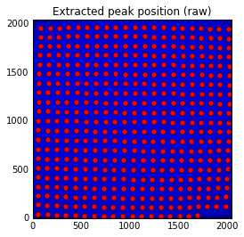

Precise peak extraction is performed using a second order tailor expansion
--------------------------------------------------------------------------

.. code:: python

    try:
        from pyFAI.bilinear import Bilinear
    except:
        from pyFAI.ext.bilinear import Bilinear
    bl = Bilinear(cnv)

.. code:: python

    ref_peaks = [bl.local_maxi(p) for p in peaks]
    imshow(img, interpolation="nearest", origin="lower")
    peaks_ref = numpy.array(ref_peaks)
    plot(peaks_raw[:,1], peaks_raw[:, 0], "or")
    plot(peaks_ref[:,1],peaks_ref[:, 0], "ob")
    xlim(0,2048)
    ylim(0,2048)
    title("Extracted peak position (red: raw, blue: refined)")
    print("Refined peak coordinate:")
    print(ref_peaks[:10])

.. parsed-literal::

    Refined peak coordinate:
    [(1953.2549439370632, 88.77039569616318), (1952.7404631972313, 1641.562735259533), (1567.744435876608, 1742.5557337403297), (998.5149356722832, 157.63702633976936), (1955.189983740449, 181.73492154479027), (1955.2447860836983, 1545.142356067896), (1956.8895792663097, 276.11039923131466), (1569.8278829306364, 1646.4742686152458), (1957.3444995582104, 1448.1315957009792), (999.5458661019802, 61.594527184963226)]

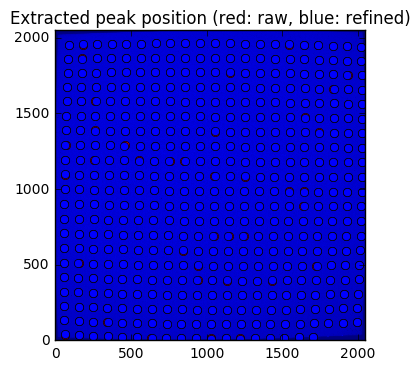

At this stage, a visual inspection of the grid confirms all peaks have
been properly segmented. If this is not the case, one can adapt:

-  the size of the kernel
-  the threshold comming out of the histogramming

Pair-wise distribution function
-------------------------------

We will now select the (4-) first neighbours for every single peak. For
this we calculate the distance\_matrix from any point to any other:

.. code:: python

    # Nota, pyFAI uses **C-coordinates** so they come out as (y,x) and not the usual (x,y). 
    # This notation helps us to remind the order
    yx = numpy.array(ref_peaks)

.. code:: python

    # pairwise distance calculation using scipy.spatial.distance_matrix
    from scipy.spatial import distance_matrix
    dist = distance_matrix(peaks_ref, peaks_ref)

Let's have a look at the pairwise distribution function for the first
neighbors

.. code:: python

    hist(dist.ravel(), 200, range=(0,200))
    title("Pair-wise distribution function")

.. parsed-literal::

    <matplotlib.text.Text at 0x7fe6afced1d0>

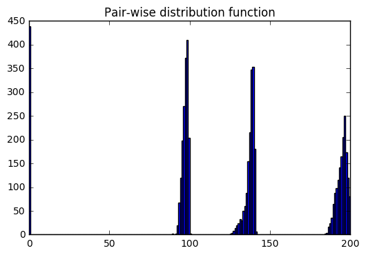

This histogram provides us:

-  At 0, the 438 peaks with 0-distance to themselves.
-  between 85 and 105 the first neighbours
-  between 125 and 150 the second neighbours.
-  ... and so on.

We now focus on the first neighbours which are all located between 70
and 110 pixel appart.

.. code:: python

    #We define here a data-type for each peak (called center) with 4 neighbours (called north, east, south and west). 
    point_type = np.dtype([('center_y', float), ('center_x', float),
                            ('east_y', float), ('east_x', float),
                            ('west_y', float), ('west_x', float),
                            ('north_y', float), ('north_x', float),
                            ('south_y', float), ('south_x', float)])
    
    neig = np.logical_and(dist>70.0, dist<110.0)
    valid = (neig.sum(axis=-1)==4).sum()
    print("There are %i control point with exactly 4 first neigbours"%valid)
    point = numpy.zeros(valid, point_type)
    # This initializes an empty structure to be populated

.. parsed-literal::

    There are 359 control point with exactly 4 first neigbours

.. code:: python

    #Populate the structure: we use a loop as it loops only over 400 points 
    h=-1
    for i, center in enumerate(peaks_ref):
        if neig[i].sum()!=4: continue
        h+=1
        point[h]["center_y"],point[h]["center_x"] = center
        for j in ((0,1),(0,-1),(1,0),(-1,0)):
            tmp = []
            for k in numpy.where(neig[i]):
                curr = yx[k]
                tmp.append(dot(curr-center,j))
                l = argmax(tmp)
                y, x = peaks_ref[numpy.where(neig[i])][l]
                if j==(0,1):point[h]["east_y"], point[h]["east_x"] = y, x
                elif j==(0,-1):point[h]["west_y"], point[h]["west_x"] = y, x
                elif j==(1,0): point[h]["north_y"],point[h]["north_x"] = y, x
                elif j==(-1,0):point[h]["south_y"],point[h]["south_x"] = y, x

We will need to define an *origin* but taking it on the border of the
image is looking for trouble as this is where distortions are likely to
be the most important. The center of the detector is an option but we
prefer to take the peak the nearest to the centroid of all other peaks.

.. code:: python

    #Select the initial guess for the center:
    
    #Most intense peak:
    #m = max([i for i in regions], key=lambda i:i.maxi)
    #Cx, Cy = m.index%img.shape[-1],m.index//img.shape[-1]
    #Cx, Cy = point["center_x"].mean(), point["center_y"].mean() #Centroid of all points
    Cx, Cy = 734, 1181 #beam center
    #Cx, Cy = tuple(i//2 for i in cnv.shape) #detector center
    print("The guessed center is at (%s, %s)"%(Cx, Cy))
    
    #Get the nearest point from centroid:
    d2 = ((point["center_x"]-Cx)**2+(point["center_y"]-Cy)**2)
    best = d2.argmin()
    Op = point[best]
    Ox, Oy = Op["center_x"], Op["center_y"]
    
    print("The center is at (%s, %s)"%(Ox, Oy))
    #Calculate the average vector along the 4 main axes 
    Xx = (point[:]["east_x"] - point[:]["center_x"]).mean()
    Xy = (point[:]["east_y"] - point[:]["center_y"]).mean()
    Yx = (point[:]["north_x"] - point[:]["center_x"]).mean()
    Yy = (point[:]["north_y"] - point[:]["center_y"]).mean()
    
    print("The X vector is is at (%s, %s)"%(Xx, Xy))
    print("The Y vector is is at (%s, %s)"%(Yx, Yy))

.. parsed-literal::

    The guessed center is at (734, 1181)
    The center is at (753.703500152, 1186.18798503)
    The X vector is is at (97.7197301826, -0.787977117653)
    The Y vector is is at (1.38218579497, 97.0826990758)

.. code:: python

    print("X has an angle of %s deg"%rad2deg(arctan2(Xy, Xx)))
    print("Y has an angle of %s deg"%rad2deg(arctan2(Yy, Yx)))
    print("The XY angle is %s deg"%rad2deg(arctan2(Yy, Yx)-arctan2(Xy, Xx)))

.. parsed-literal::

    X has an angle of -0.462002756355 deg
    Y has an angle of 89.1843236418 deg
    The XY angle is 89.6463263982 deg

.. code:: python

    x = point[:]["center_x"] - Ox
    y = point[:]["center_y"] - Oy
    xy = numpy.vstack((x,y))
    R = numpy.array([[Xx,Yx],[Xy,Yy]])
    iR = numpy.linalg.inv(R)
    IJ = dot(iR,xy).T

.. code:: python

    Xmin = IJ[:,0].min()
    Xmax = IJ[:,0].max()
    Ymin = IJ[:,1].min()
    Ymax = IJ[:,1].max()
    print("Xmin/max",Xmin, Xmax)
    print("Ymin/max",Ymin,Ymax)
    print("Maximum error versus integrer: %s * pitch size (5mm)"%(abs(IJ-IJ.round()).max()))

.. parsed-literal::

    Xmin/max -6.07394212848 12.060721056
    Ymin/max -11.0890545732 7.04060363671
    Maximum error versus integrer: 0.117211354675 * pitch size (5mm)

At this point it is important to check the correct rounding to integers:
The maximum error should definitely be better than 0.2\*pitch ! If not,
try to change the origin (Cx and Cy). This criteria will be used for the
optimization later on.

.. code:: python

    plot(IJ[:,0],IJ[:,1],"or")
    idx = numpy.round(IJ).astype(int)
    plot(idx[:,0],IJ[:,1],"og")
    xlim(floor(Xmin), ceil(Xmax))
    ylim(floor(Ymin), ceil(Ymax))
    title("Red: measured peaks, Green: Expected position")

.. parsed-literal::

    <matplotlib.text.Text at 0x7fe6af9a06a0>

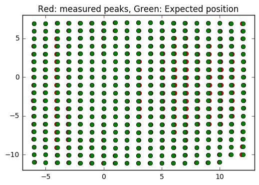

Estimation of the pixel size:
~~~~~~~~~~~~~~~~~~~~~~~~~~~~~

The pixel size is obtained from the pitch of the grid, in vectorial:

pitch^2 = (Px\*Xx)^2 + (Py Xy)^2

pitch^2 = (Px\*Yx)^2 + (Py Yy)^2

.. code:: python

    pitch = 5e-3 #mm distance between holes
    Py = pitch*sqrt((Yx**2-Xx**2)/((Xy*Yx)**2-(Xx*Yy)**2))
    Px = sqrt((pitch**2-(Xy*Py)**2)/Xx**2)
    print("Pixel size in average: x:%.3f micron, y: %.3f microns"%(Px*1e6, Py*1e6))

.. parsed-literal::

    Pixel size in average: x:51.165 micron, y: 51.497 microns

At this stage, we have:

-  A list of control points placed on a regular grid with a sub-pixel
   precision
-  The center of the image, located on a control point
-  the average X and Y vector to go from one control point to another

Optimization of the pixel position
----------------------------------

The optimization is obtained by minimizing the mis-placement of the
control points on the regular grid. For a larger coverage we include now
the peaks on the border with less than 4 neighbours.

.. code:: python

    #Measured peaks (all!), needs to flip x<->y
    peaks_m = numpy.empty_like(peaks_ref)
    peaks_m[:,1] = peaks_ref[:,0]
    peaks_m[:,0] = peaks_ref[:,1]
    
    #parameter set for optimization:
    P0 = [Ox, Oy, Xx, Yx, Xy, Yy]
    
    P = numpy.array(P0)
    
    def to_hole(P, pixels):
        "Translate pixel -> hole"
        T = numpy.atleast_2d(P[:2])
        R = P[2:].reshape((2,2))
    
        #Transformation matrix from pixel to holes:
        hole = dot(numpy.linalg.inv(R), (pixels - T).T).T
        return hole
    
    def to_pix(P, holes):
        "Translate hole -> pixel"
        T = numpy.atleast_2d(P[:2])
        R = P[2:].reshape((2,2))
        #Transformation from index points (holes) to pixel coordinates: 
        pix = dot(R,holes.T).T + T
        return pix
    
    def error(P):
        "Error function"
        hole_float = to_hole(P, peaks_m)
        hole_int = hole_float.round()
        delta = hole_float-hole_int
        delta2 = (delta**2).sum()
        return delta2
    
    print("Total inital error ", error(P), P0)
    holes = to_hole(P, peaks_m)
    print("Maximum initial error versus integrer: %s * pitch size (5mm)"%(abs(holes-holes.round()).max()))
    from scipy.optimize import minimize
    res = minimize(error, P)
    print(res)
    print("total Final error ", error(res.x),res.x)
    holes = to_hole(res.x, peaks_m)
    print("Maximum final error versus integrer: %s * pitch size (5mm)"%(abs(holes-holes.round()).max()))

.. parsed-literal::

    Total inital error  2.5995763607 [753.70350015163422, 1186.1879850327969, 97.719730182623479, 1.3821857949656571, -0.78797711765336542, 97.082699075794565]
    Maximum initial error versus integrer: 0.199838456433 * pitch size (5mm)
          fun: 2.1237728421683664
     hess_inv: array([[  1.42593966e+01,   5.44352852e-01,  -8.73479841e-01,
              5.68748502e-01,  -2.33073665e-02,   4.10718930e-02],
           [  5.44352852e-01,   1.43410848e+01,  -2.15692202e-02,
              2.26610844e-02,  -8.65679493e-01,   5.70957152e-01],
           [ -8.73479841e-01,  -2.15692202e-02,   2.99975175e-01,
             -4.39948219e-03,   3.21018068e-03,  -2.79429948e-03],
           [  5.68748502e-01,   2.26610844e-02,  -4.39948219e-03,
              3.01817357e-01,  -1.20164054e-03,   3.36669161e-03],
           [ -2.33073665e-02,  -8.65679493e-01,   3.21018068e-03,
             -1.20164054e-03,   2.96516360e-01,  -3.90213340e-03],
           [  4.10718930e-02,   5.70957152e-01,  -2.79429948e-03,
              3.36669161e-03,  -3.90213340e-03,   2.95822053e-01]])
          jac: array([  0.00000000e+00,   2.98023224e-08,   8.94069672e-08,
             1.49011612e-07,   5.66244125e-07,   5.66244125e-07])
      message: 'Optimization terminated successfully.'
         nfev: 160
          nit: 15
         njev: 20
       status: 0
      success: True
            x: array([  7.53021132e+02,   1.18519692e+03,   9.81143528e+01,
             1.47509458e+00,  -8.04478630e-01,   9.73166898e+01])
    total Final error  2.12377284217 [  7.53021132e+02   1.18519692e+03   9.81143528e+01   1.47509458e+00
      -8.04478630e-01   9.73166898e+01]
    Maximum final error versus integrer: 0.234645015753 * pitch size (5mm)

.. code:: python

    clf()
    peaks_c = to_pix(res.x,to_hole(res.x,peaks_m).round())
    imshow(img, interpolation="nearest", origin="lower")
    plot(peaks_m[:,0],peaks_m[:, 1], "or")
    plot(peaks_c[:,0], peaks_c[:, 1], "og")
    xlim(0,2048)
    ylim(0,2048)
    title("Peak position: measured (red) and expected (Green)")

.. parsed-literal::

    <matplotlib.text.Text at 0x7fe6af965b00>

.. image:: output_45_1.png

.. code:: python

    pitch = 5e-3 #mm distance between holes
    Ox, Oy, Xx, Yx, Xy, Yy = res.x
    Py = pitch*sqrt((Yx**2-Xx**2)/((Xy*Yx)**2-(Xx*Yy)**2))
    Px = sqrt((pitch**2-(Xy*Py)**2)/Xx**2)
    print("Optimized pixel size in average: x:%.3f micron, y: %.3f microns"%(Px*1e6, Py*1e6))

.. parsed-literal::

    Optimized pixel size in average: x:50.959 micron, y: 51.373 microns

Few comments:

-  The maximum error grow during optimization without explainations
-  The outer part of the detector is the most distorted

Interpolation of the fitted data
--------------------------------

Multivariate data interpolation (griddata)
~~~~~~~~~~~~~~~~~~~~~~~~~~~~~~~~~~~~~~~~~~

Correction arrays are built slightly larger (+1) to be able to
manipulate corners instead of centers of pixels As coordinates are
needed as y,x (and not x,y) we use p instead of peaks\_m

.. code:: python

    from scipy.interpolate import griddata
    grid_x, grid_y = np.mgrid[0:img.shape[0]+1, 0:img.shape[1]+1]
    delta = peaks_c - peaks_m
    #we use peaks_res instead of peaks_m to be in y,x coordinates, not x,y
    delta_x = griddata(peaks_ref, delta[:,0], (grid_x, grid_y), method='cubic')
    delta_y = griddata(peaks_ref, delta[:,1], (grid_x, grid_y), method='cubic')
    
    figure(figsize=(12,5))
    subplot(1,2,1)
    imshow(delta_x,origin="lower", interpolation="nearest")
    title(r"$\delta$ x")
    colorbar()
    subplot(1,2,2)
    imshow(delta_y, origin="lower", interpolation="nearest")
    title(r"$\delta$ y")
    colorbar()
    #Nota: the arrays are filled with "NaN" outside the convex Hull

.. parsed-literal::

    <matplotlib.colorbar.Colorbar at 0x7fe6ab7c6da0>

.. image:: output_48_1.png

.. code:: python

    #From http://stackoverflow.com/questions/3662361/fill-in-missing-values-with-nearest-neighbour-in-python-numpy-masked-arrays
    def fill(data, invalid=None):
        """
        Replace the value of invalid 'data' cells (indicated by 'invalid') 
        by the value of the nearest valid data cell
    
        Input:
            data:    numpy array of any dimension
            invalid: a binary array of same shape as 'data'. True cells set where data
                     value should be replaced.
                     If None (default), use: invalid  = np.isnan(data)
    
        Output: 
            Return a filled array. 
        """
    
        if invalid is None: 
            invalid = numpy.isnan(data)
    
        ind = ndimage.distance_transform_edt(invalid, return_distances=False, return_indices=True)
        return data[tuple(ind)]

.. code:: python

    figure(figsize=(12,5))
    subplot(1,2,1)
    imshow(fill(delta_x),origin="lower", interpolation="nearest")
    title(r"$\delta$ x")
    colorbar()
    subplot(1,2,2)
    imshow(fill(delta_y), origin="lower", interpolation="nearest")
    title(r"$\delta$ y")
    colorbar()

.. parsed-literal::

    <matplotlib.colorbar.Colorbar at 0x7fe6a84c9b00>

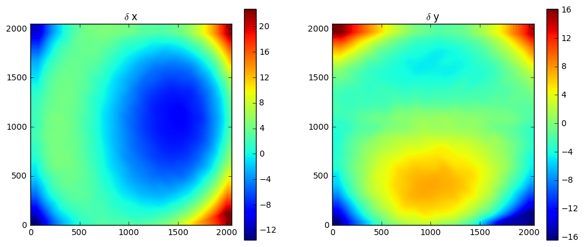

It is important to understand the extrapolation outside the convex hull
has no justification, it is there just to prevent numerical bugs.

Saving the distortion correction arrays to a detector
-----------------------------------------------------

.. code:: python

    from pyFAI.detectors import Detector
    detector = Detector(Py,Px)
    detector.max_shape = detector.shape = img.shape
    detector.set_dx(fill(delta_x))
    detector.set_dy(fill(delta_y))
    detector.mask = numpy.isnan(delta_x).astype(numpy.int8)[:img.shape[0], :img.shape[1]]
    detector.save("testdetector.h5")

Validation of the distortion correction
---------------------------------------

.. code:: python

    from pyFAI.distortion import Distortion
    dis = Distortion(detector)
    cor = dis.correct(img)
    figure(figsize=(12,5))
    subplot(1,2,1)
    imshow(img, interpolation="nearest", origin="lower")
    title("Original")
    subplot(1,2,2)
    imshow(cor, origin="lower", interpolation="nearest")
    title("Corrected")
    fabio.edfimage.EdfImage(data=cor).save("corrected.edf")

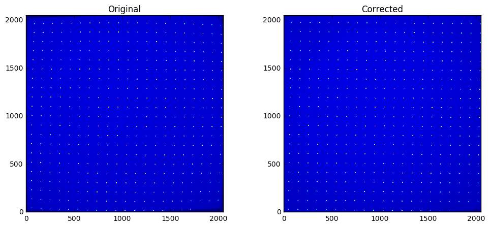

Conclusion
==========

This procedure describes how to measure the detector distortion and how
to create a detector description file directly useable in pyFAI. Only
the region inside the convex hull of the grid data-points is valid and
the region of the detector which is not calibrated has been masked out
to preven accidental use of it.

The distortion corrected image can now be used to check how "good" the
calibration actually is. This file can be injected in the third cell,
and follow the same procedure (left as exercise). This gives a maximum
mis-placement of 0.003, the average error is then of 0.0006 and
correction-map exhibit a displacement of pixels in the range +/- 0.2
pixels which is acceptable and validates the whole procedure.
