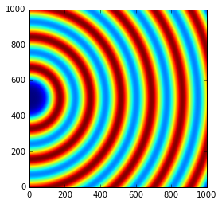
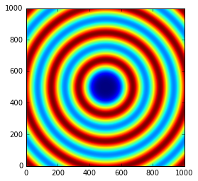
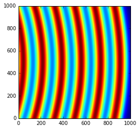
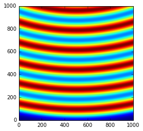
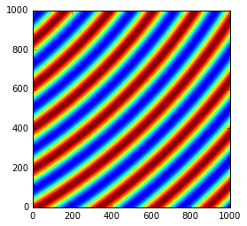

Geometries in pyFAI
===================

This notebook demonstrates the different orientations of axes in the
geometry used by pyFAI.

Demonstration
-------------

The tutorial uses the ipython notebook (aka Jupyter).

.. code:: python

    %pylab inline

.. parsed-literal::

    Populating the interactive namespace from numpy and matplotlib

.. code:: python

    import pyFAI
    from pyFAI.calibrant import ALL_CALIBRANTS

.. parsed-literal::

    WARNING:pyFAI.utils:Exception No module named 'fftw3': FFTw3 not available. Falling back on Scipy

We will use a fake detector of 1000x1000 pixels of 100\_µm each. The
simulated beam has a wavelength of 0.1\_nm and the calibrant chose is
silver behenate which gives regularly spaced rings. The detector will
originally be placed at 1\_m from the sample.

.. code:: python

    wl = 1e-10
    cal = ALL_CALIBRANTS["AgBh"]
    cal.wavelength=wl

    detector = pyFAI.detectors.Detector(100e-6, 100e-6)
    detector.max_shape=(1000,1000)

    ai = pyFAI.AzimuthalIntegrator(dist=1, detector=detector)
    ai.wavelength = wl

.. code:: python

    img = cal.fake_calibration_image(ai)
    imshow(img, origin="lower")

.. parsed-literal::

    <matplotlib.image.AxesImage at 0x7f997becf7b8>

.. image:: output_6_1.png

Translation orthogonal to the beam: poni1 and poni2
---------------------------------------------------

We will now set the first dimension (vertical) offset to the center of
the detector: 100e-6 \* 1000 / 2

.. code:: python

    p1 = 100e-6 * 1000 / 2
    print(p1)
    ai.poni1 = p1
    img = cal.fake_calibration_image(ai)
    imshow(img, origin="lower")

.. parsed-literal::

    0.05

.. parsed-literal::

    <matplotlib.image.AxesImage at 0x7f997ae09be0>

Let's do the same in the second dimensions: along the horizontal axis

.. code:: python

    p2 = 100e-6 * 1000 / 2
    print(p2)
    ai.poni2 = p2
    print(ai)
    img = cal.fake_calibration_image(ai)
    imshow(img, origin="lower")

.. parsed-literal::

    0.05
    Detector Detector	 Spline= None	 PixelSize= 1.000e-04, 1.000e-04 m
    Wavelength= 1.000000e-10m
    SampleDetDist= 1.000000e+00m	PONI= 5.000000e-02, 5.000000e-02m	rot1=0.000000  rot2= 0.000000  rot3= 0.000000 rad
    DirectBeamDist= 1000.000mm	Center: x=500.000, y=500.000 pix	Tilt=0.000 deg  tiltPlanRotation= 0.000 deg

.. parsed-literal::

    <matplotlib.image.AxesImage at 0x7f997ade7a20>

The image is now properly centered. We will now investigate the rotation
along the different axes.

Investigation on the rotations:
-------------------------------

Any rotations of the detector apply after the 3 translations (*dist*,
*poni1* and *poni2*)

The first axis is the vertical one and a rotation around it ellongates
ellipses along the orthogonal axis:

.. code:: python

    rotation = +0.2
    ai.rot1 = rotation
    print(ai)
    img = cal.fake_calibration_image(ai)
    imshow(img, origin="lower")

.. parsed-literal::

    Detector Detector	 Spline= None	 PixelSize= 1.000e-04, 1.000e-04 m
    Wavelength= 1.000000e-10m
    SampleDetDist= 1.000000e+00m	PONI= 5.000000e-02, 5.000000e-02m	rot1=0.200000  rot2= 0.000000  rot3= 0.000000 rad
    DirectBeamDist= 1020.339mm	Center: x=-1527.100, y=500.000 pix	Tilt=11.459 deg  tiltPlanRotation= 180.000 deg

.. parsed-literal::

    <matplotlib.image.AxesImage at 0x7f997ad42ef0>

So a positive rot1 is equivalent to turning the detector to the right,
around the sample position (where the observer is).

Let's consider now the rotation along the horizontal axis, rot2:

.. code:: python

    rotation = +0.2
    ai.rot1 = 0
    ai.rot2 = rotation
    print(ai)
    img = cal.fake_calibration_image(ai)
    imshow(img, origin="lower")

.. parsed-literal::

    Detector Detector	 Spline= None	 PixelSize= 1.000e-04, 1.000e-04 m
    Wavelength= 1.000000e-10m
    SampleDetDist= 1.000000e+00m	PONI= 5.000000e-02, 5.000000e-02m	rot1=0.000000  rot2= 0.200000  rot3= 0.000000 rad
    DirectBeamDist= 1020.339mm	Center: x=500.000, y=2527.100 pix	Tilt=11.459 deg  tiltPlanRotation= 90.000 deg

.. parsed-literal::

    <matplotlib.image.AxesImage at 0x7f997ad26710>

So a positive rot2 is equivalent to turning the detector to the down, around the sample position (where the observer is).

Now we can combine the two first rotations and check for the effect of the third rotation.

.. code:: python

    rotation = +0.2
    ai.rot1 = rotation
    ai.rot2 = rotation
    ai.rot3 = 0
    print(ai)
    img = cal.fake_calibration_image(ai)
    imshow(img, origin="lower")

.. parsed-literal::

    Detector Detector	 Spline= None	 PixelSize= 1.000e-04, 1.000e-04 m
    Wavelength= 1.000000e-10m
    SampleDetDist= 1.000000e+00m	PONI= 5.000000e-02, 5.000000e-02m	rot1=0.200000  rot2= 0.200000  rot3= 0.000000 rad
    DirectBeamDist= 1041.091mm	Center: x=-1527.100, y=2568.329 pix	Tilt=16.151 deg  tiltPlanRotation= 134.423 deg

.. parsed-literal::

    <matplotlib.image.AxesImage at 0x7f997ac835c0>

.. image:: output_16_2.png

.. code:: python

    rotation = +0.2
    import copy
    ai2 = copy.copy(ai)
    ai2.rot1 = rotation
    ai2.rot2 = rotation
    ai2.rot3 = rotation
    print(ai2)
    img2 = cal.fake_calibration_image(ai2)
    imshow(img2, origin="lower")

.. parsed-literal::

    Detector Detector	 Spline= None	 PixelSize= 1.000e-04, 1.000e-04 m
    Wavelength= 1.000000e-10m
    SampleDetDist= 1.000000e+00m	PONI= 5.000000e-02, 5.000000e-02m	rot1=0.200000  rot2= 0.200000  rot3= 0.200000 rad
    DirectBeamDist= 1041.091mm	Center: x=-1527.100, y=2568.329 pix	Tilt=16.151 deg  tiltPlanRotation= 134.423 deg

.. parsed-literal::

    <matplotlib.image.AxesImage at 0x7f997ac63f60>

If one considers the rotation along the incident beam, there is no
visible effect on the image as the image is invariant along this
transformation.

To actually see the effect of this third rotation one needs to perform
the azimuthal integration and display the result with properly labeled
axes.

.. code:: python

    subplot(1,2,1)
    I, tth, chi = ai.integrate2d(img, 300, 360, unit="2th_deg")
    imshow(I, origin="lower", extent=[tth.min(), tth.max(), chi.min(), chi.max()], aspect="auto")
    xlabel("2 theta (deg)")
    ylabel("Chi (deg)")
    subplot(1,2,2)
    I, tth, chi = ai2.integrate2d(img2, 300, 360, unit="2th_deg")
    imshow(I, origin="lower", extent=[tth.min(), tth.max(), chi.min(), chi.max()], aspect="auto")
    xlabel("2 theta (deg)")
    ylabel("Chi (deg)")

.. parsed-literal::

    WARNING:pyFAI.geometry:No fast path for space: None
    WARNING:pyFAI.geometry:No fast path for space: None

.. parsed-literal::

    <matplotlib.text.Text at 0x7f997abd99e8>

.. image:: output_19_2.png

So the increasing *rot3* creates more negative azimuthal angles: it is
like rotating the detector clockwise around the incident beam.

Conclusion
----------

All 3 translations and all 3 rotations can be summarized in the following
figure:

.. figure:: ../../../img/PONI.png
   :alt: test

   PONI figure

It may appear strange to have (x\_1, x\_2, x\_3) indirect but
this has been made in such a way chi, the azimuthal angle, is 0 along
x\_2 and 90\_deg along x\_1 (and not vice-versa).
